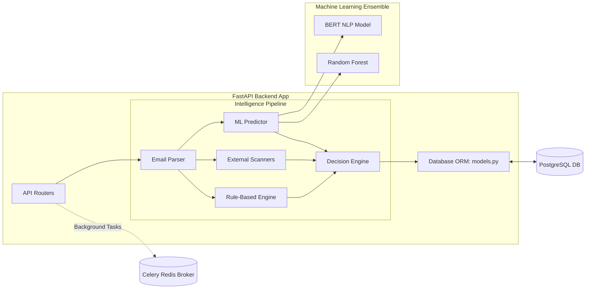
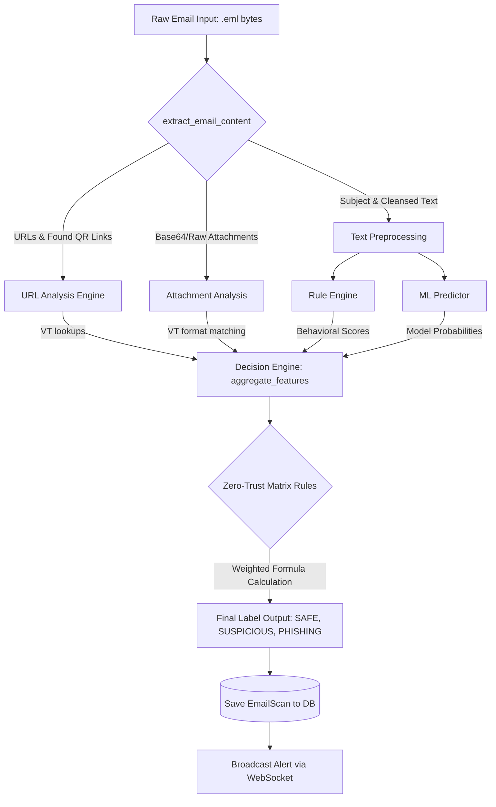

# PhishGuard System Architecture

This document contains all the primary architecture, UML, and sequence diagrams tailored exactly to the PhishGuard codebase. 

---

## 1. System Context Diagram
Illustrates how the system communicates with the outside world, including end users, internal SOC admins, email servers, and threat intelligence feeds.

```mermaid
graph TD
    %% External Entities
    User[End User / General Employee]
    Admin[SOC Analyst / Admin]
    IMAP[IMAP Server / MS Exchange / Gmail]
    VT[VirusTotal API]

    %% Main System
    subgraph PhishGuard Core System
        Frontend[React User Extension / Standard Frontend]
        SOC[React SOC Dashboard]
        Backend[FastAPI Backend Server]
    end

    %% Relationships
    User -->|Uploads .eml / Views Results| Frontend
    Admin -->|Manages Alerts / Reviews Emails| SOC
    Frontend <-->|REST API / WebSocket| Backend
    SOC <-->|REST API / WebSocket| Backend
    Backend <--|Fetch Latest Emails via IMAP| IMAP
    Backend -->|Check URL/File Hashes| VT
```

## 2. High-Level Backend Component Architecture
Breaks down the FastAPI backend directory structure and its connection to the database and ML models.



## 3. Data Flow Diagram (DFD) - Analysis Engine
Shows how incoming bytes transform into a scored database record.


